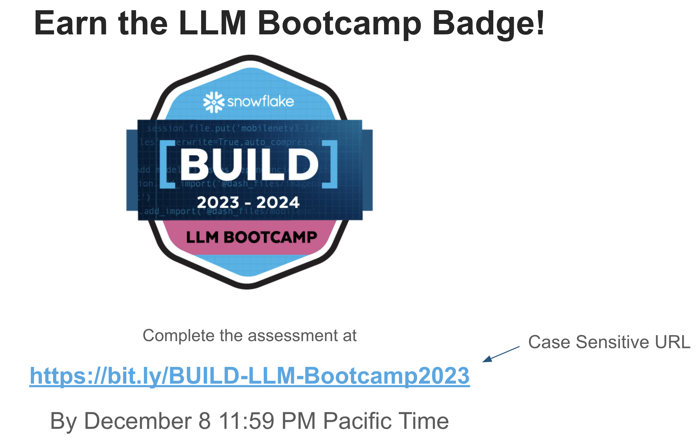

# BUILD LLM Bootcamp 2023

This repository contains instrcutions, code and data required to successfully complete LLM Bootcamp for BUILD 2023.

### Day 1: Deploy Llama 2 from Hugging Face in Snowpark Container Services

Learn more in the [README](/day1/README.md).

### Day 2: Fine-tune and Deploy Llama 2 in Snowpark Container Services

Learn more in the [README](/day2/README.md).

### Earn the LLM Bootcamp Badge

After attending the Day 1 and Day 2 Bootcamp sessions, [earn the badge after completing the assessment](https://bit.ly/BUILD-LLM-Bootcamp2023) by December 8, 2023 11:59PM Pacific Time.

---

For questions and comments about this repository, please reach out to [Dash](dash.desai@snowflake.com).
